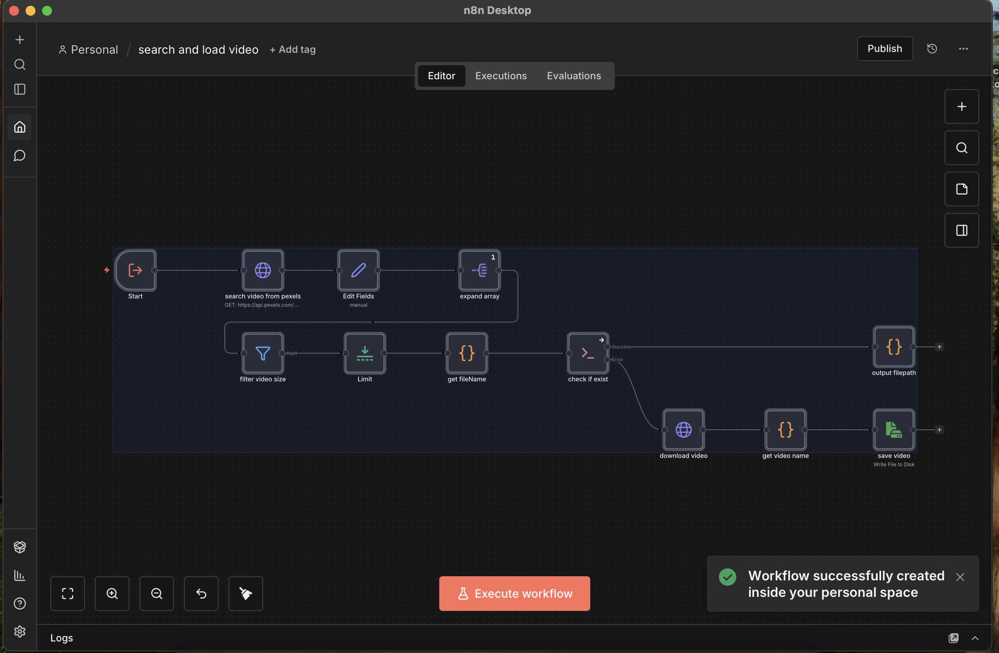

# n8n Desktop


一个基于 Tauri 构建的 n8n 桌面应用程序，提供跨平台的本地工作流自动化体验。本项目旨在简化 n8n 的安装和使用，实现一键安装：无需手动配置 Node.js 环境，无需安装 Docker。



## 📋 重要声明

### 版权与使用声明
1. **项目性质**: 本项目是基于 [n8n](https://github.com/n8n-io/n8n) 开源项目打包的桌面应用程序，仅供个人学习、研究和测试使用。
2. **非商业用途**: 本项目不得用于任何商业用途，包括但不限于销售、租赁、商业部署等。
3. **知识产权**: n8n 及相关商标、版权归其原始所有者所有。本项目仅为技术封装，不拥有 n8n 的核心知识产权。
4. **侵权处理**: 如本项目侵犯了您的合法权益，请联系 `taoge646@gmail.com`，我们将立即删除相关仓库。
5. **免责声明**: 使用本项目产生的任何后果由使用者自行承担，项目维护者不承担任何责任。

### 安全警告
**重要安全声明**：本项目打包解禁了 n8n 官方的禁用节点（如：ExecuteCommand 等）。

**安全风险提示**：
1. **命令注入风险**：ExecuteCommand 节点允许执行系统命令，恶意工作流可能导致数据丢失、系统损坏或安全漏洞
2. **数据安全**：不当使用可能导致敏感数据泄露

**使用建议**：
- 仅在受信任的隔离环境中使用
- 不要在生产环境或包含敏感数据的系统中使用
- 仔细审查所有导入的工作流，避免执行未知来源的代码
- 定期备份重要数据

**免责声明**：
因使用不安全命令注入 ExecuteCommand 节点造成数据损失的，本项目开发者概不负责。使用者需自行承担所有风险。

### 开源协议
- 本项目代码部分采用 MIT 许可证
- n8n 核心采用 [Sustainable Use License](https://github.com/n8n-io/n8n/blob/master/LICENSE.md)
- 请遵守各组件对应的开源协议

## 🚀 功能特性

- **跨平台支持**: Windows、macOS、Linux 全平台
- **自动下载依赖**: 首次运行自动下载 Node.js 运行时和 n8n 核心包
- **离线使用**: 本地运行，保护数据隐私
- **手动解禁节点**: 内置支持启用受限节点（如 ExecuteCommand），用于高级工作流自动化
- **Cloudflared 隧道集成**: 创建安全隧道以暴露本地 n8n 实例，支持临时或自定义域名隧道

## 🌐 Cloudflared 隧道功能

应用程序集成了 Cloudflare Tunnel 功能，可安全地将本地 n8n 实例暴露到互联网。

### 隧道类型

1. **临时隧道**
   - 一键创建隧道，使用随机生成的子域名
   - 无需 Cloudflare 账户
   - 适合快速测试和临时访问

2. **固定域名隧道**
   - 使用您自己的自定义域名（需配置 Cloudflare）
   - 需要 Cloudflare 账户和域名配置
   - 为 n8n 实例提供持久、品牌化的 URL

### Cloudflared 使用指南

详细设置说明和官方文档请参考：
- [Cloudflare Tunnel 官方文档](https://developers.cloudflare.com/cloudflare-one/connections/connect-networks/)
- [通过仪表板创建隧道](https://developers.cloudflare.com/cloudflare-one/connections/connect-networks/get-started/create-remote-tunnel/)
- [Cloudflared CLI 参考](https://developers.cloudflare.com/cloudflare-one/connections/connect-networks/use-cases/access/)

### 安全注意事项
- 所有隧道均通过 Cloudflare 基础设施进行端到端加密
- 临时隧道在会话结束后自动过期
- 生产环境使用时，请配置适当的身份验证和访问控制

## 📦 下载安装

### 最新版本
访问 [Releases](https://github.com/tangtao646/n8n-desktop/releases) 页面下载对应平台的安装包：

- **macOS**: `.dmg` 文件（支持 Intel 和 Apple Silicon）
- **Windows**: `.exe` 安装程序或 `.msi` 包
- **Linux**: `.AppImage` 或 `.deb` 包

### 系统要求
- **macOS**: 10.15 (Catalina) 或更高版本
- **Windows**: Windows 10 或更高版本（64位）
- **Linux**: 支持 AppImage 的主流发行版

### macOS 安装问题解决
如果 macOS 系统提示"文件已损坏"或"打不开"，这是因为 macOS 的安全机制阻止了未签名的应用。解决方法：

1. **打开终端** (Terminal)
2. **执行以下命令**：
```bash
sudo xattr -rd com.apple.quarantine /Applications/n8n-desktop.app
```
3. **输入管理员密码**（输入时不会显示字符）
4. **重新打开应用**

> **注意**：此命令会移除应用的隔离属性，仅适用于从可信来源下载的应用。

## 🛠️ 开发构建

### 环境要求
- Node.js 20+
- Rust 1.70+
- pnpm 8+

### 本地开发
```bash
# 克隆仓库
git clone https://github.com/tangtao646/n8n-desktop.git
cd n8n-desktop

# 安装依赖
pnpm install

# 开发模式运行
pnpm tauri dev
```

### 构建应用
```bash
# 构建所有平台
pnpm tauri build

# 构建特定平台
pnpm tauri build --target universal-apple-darwin  # macOS 通用
pnpm tauri build --target x86_64-pc-windows-msi   # Windows
pnpm tauri build --target x86_64-unknown-linux-gnu # Linux
```

### 数据目录
应用数据存储在用户目录下：
- **macOS**: `~/Library/Application Support/n8n-desktop/`
- **Windows**: `%APPDATA%\n8n-desktop\`
- **Linux**: `~/.local/share/n8n-desktop/`

包含：
- `runtime/`: Node.js 运行时
- `n8n/`: n8n 核心文件
- `logs/`: 应用日志
- `config/`: 配置文件


### 获取帮助
- 查看 [Issues](https://github.com/tangtao646/n8n-desktop/issues) 页面
- 提交新的 Issue 报告问题

## 🤝 贡献指南

欢迎提交 Issue 和 Pull Request！


### 代码规范
- TypeScript: 使用 ESLint 和 Prettier
- Rust: 遵循 Rust 官方编码规范
- 提交信息: 使用 Conventional Commits

## 📄 许可证

本项目采用 MIT 许可证 - 查看 [LICENSE](LICENSE) 文件了解详情。

## 🙏 致谢

- [n8n](https://github.com/n8n-io/n8n) - 强大的工作流自动化平台
- [Tauri](https://tauri.app/) - 构建小型、快速桌面应用的框架
- [React](https://reactjs.org/) - 用于构建用户界面的 JavaScript 库

## 📞 联系方式

如有问题或建议，请通过以下方式联系：
- **邮箱**: taoge646@gmail.com
- **GitHub Issues**: [提交 Issue](https://github.com/tangtao646/n8n-desktop/issues)


**再次提醒**: 本项目仅供个人学习使用，请勿用于商业用途。尊重开源软件的知识产权，遵守相关许可证规定。
